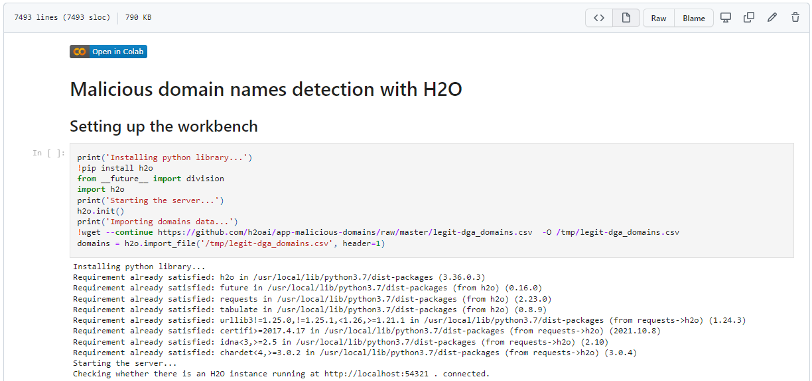
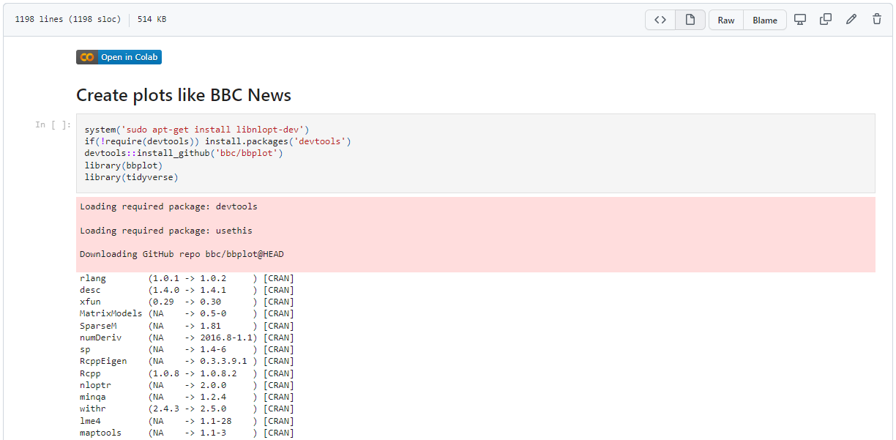

```{r setup, include=FALSE}
knitr::opts_chunk$set(echo = FALSE)
library(tidyverse)
```

## <span>.</span>Outline

- Recap of the March meeting

- Why use graphics to tell a story?

- How to plot in R?

- Code Surgery - using `bbplot` library of BBC News data team


## <span>.</span>March meeting  {.columns-1}

{width=100%}

## <span>.</span>Why use graphics to tell a story?  {.columns-2}

*A picture is worth a thousand words* is an adage in multiple languages meaning that complex and sometimes multiple ideas can be conveyed by a single still image, which conveys its meaning or essence more effectively than a mere verbal description.

~*~

On the picture Provincial Government Buildings on the Meuse (Wikipedia)

<p class="forceBreak"></p>  

{width=100%}


## <span>.</span>How to plot in R? {.columns-2}

Some plotting verbs in `R`:

- `plot`

- `pairs`

- `hist`

- `autoplot`

- `scatterplot3d`

- `ggplot`

- `...`

<p class="forceBreak"></p>

```{r, echo=TRUE, eval=FALSE}
library(tidyverse)
df <- data.frame(
  x = c(1:100),
  y = runif(100),
  class = sample(c('0', '1'), 
                 size = 100, 
                 replace = T)
)
df %>% ggplot() +
  aes(x = x, y = y, colour = class) +
  geom_point() +
  labs(title = 'My important insights')
```

Cheatsheet: 
[https://github.com/rstudio/cheatsheets/
blob/main/data-visualization-2.1.pdf](https://github.com/rstudio/cheatsheets/blob/main/data-visualization-2.1.pdf)


## <span>.</span>How to plot in R? {.columns-1}

```{r, echo=FALSE, eval=TRUE}
library(tidyverse)
df <- data.frame(
  x = c(1:100),
  y = runif(100),
  class = sample(c('0', '1'), 
                 size = 100, 
                 replace = T)
)
df %>% ggplot() +
  aes(x = x, y = y, colour = class) +
  geom_point() +
  labs(title = 'My important insights')
```

## <span>.</span>How to plot in R? {.columns-1}

```{r, echo=TRUE, eval=FALSE, message=FALSE}
iris %>%  
  ggplot() +
  aes(x=Sepal.Width, fill=Species) + 
  geom_density(stat="density", alpha=I(0.2)) +
  xlab("Sepal Width") +
  ylab("Density") +
  ggtitle("Density Curve of Sepal Width")
```

## <span>.</span>How to plot in R? {.columns-1}

```{r, echo=FALSE, message=FALSE}
iris %>%  
  ggplot() +
  aes(x=Sepal.Width, fill=Species) + 
  geom_density(stat="density", alpha=I(0.2)) +
  xlab("Sepal Width") +
  ylab("Density") +
  ggtitle("Density Curve of Sepal Width")
```


## <span>.</span>Code Surgery - plot like BBC News

{width=100%}

