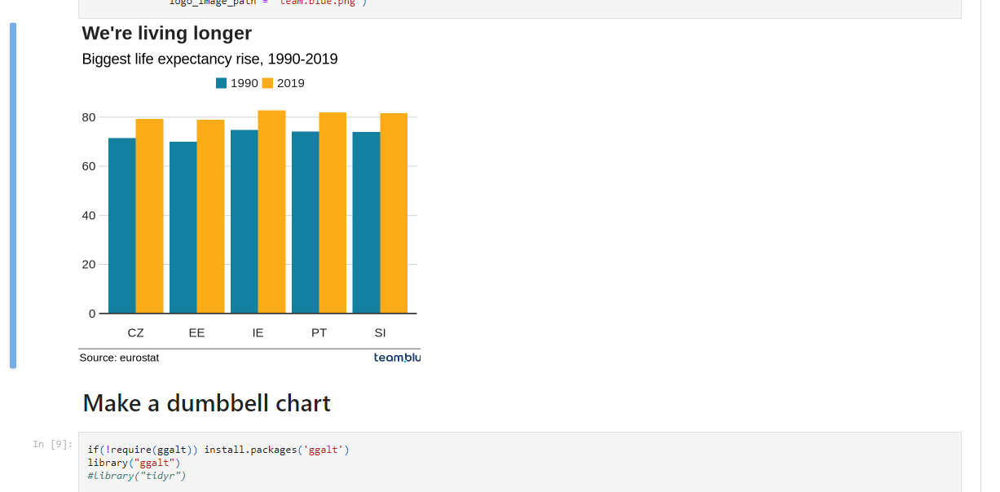
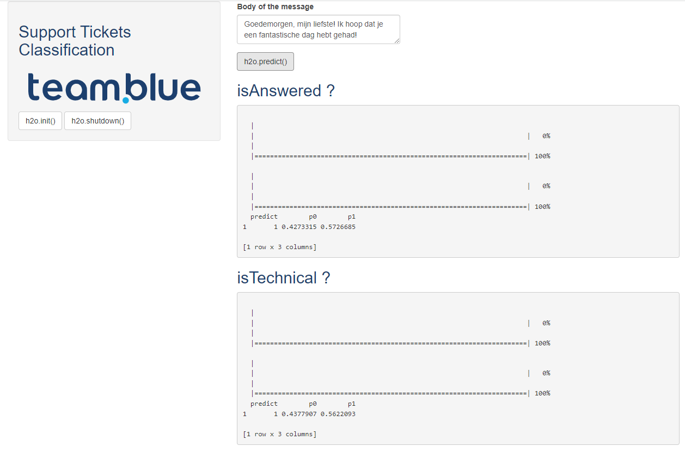

```{r setup, include=FALSE}
knitr::opts_chunk$set(echo = FALSE)
library(tidyverse)
```

## <span>.</span>Outline

- Recap of the April meeting

- Tidy text mining in R

- Tidy text classification in R

- TransIP / team.blue previous project

- Code Surgery - Dutch restaurants reviews analysis


## <span>.</span>April meeting  {.columns-1}

{width=90%}

## <span>.</span>Text mining in R {.columns-1}

Text mining (also referred to as text analytics) is an artificial intelligence (AI) technology that uses natural language processing (NLP) to transform the free (unstructured) text in documents and databases into normalized, structured data suitable for analysis or to drive machine learning (ML) algorithms.

https://www.tidytextmining.com/ (Welcome to Text Mining with R)

## <span>.</span>Text classification in R {.columns-1}

Text classification is a machine learning technique that assigns a set of predefined categories to open-ended text. Text classifiers can be used to organize, structure, and categorize pretty much any kind of text – from documents, medical studies and files, and all over the web.

https://smltar.com/ (Supervised Machine Learning for Text Analysis in R)

## <span>.</span>Support Tickets Classification  {.columns-1}

{width=80%}


## <span>.</span>Code Surgery - Dutch restaurants reviews

{width=65%}

