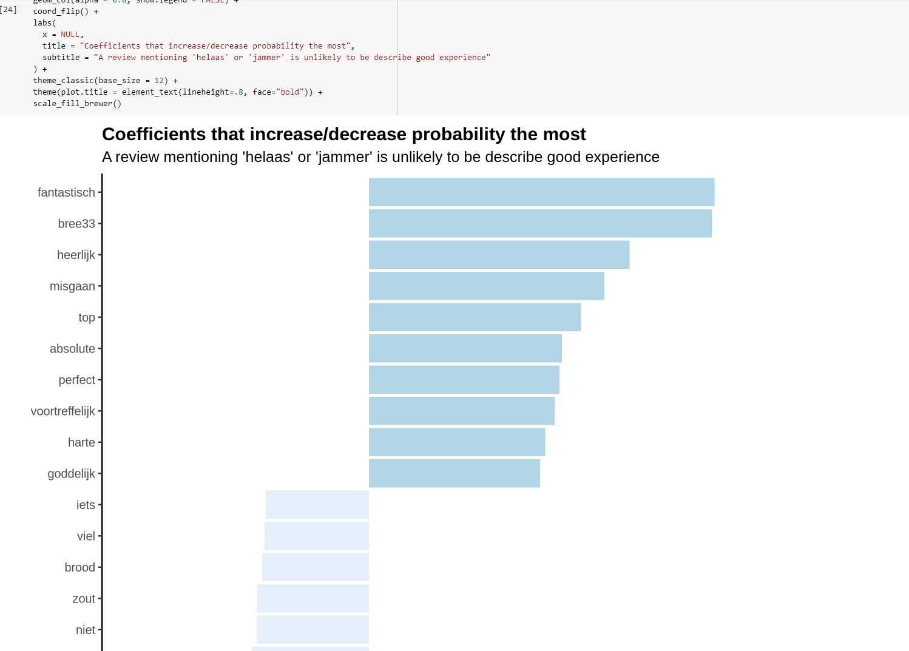

```{r setup, include=FALSE}
knitr::opts_chunk$set(echo = FALSE)
library(tidyverse)
```

## <span>.</span>Outline

- Recap of the May meeting

- Simple Features

- Thematic maps

- Interactive maps

- Code Surgery - Dutch restaurants locations analysis


## <span>.</span>May meeting  {.columns-1}

Dutch restaurants reviews analysis

{width=65%}

## <span>.</span>Spatial analysis {.columns-1}

**Spatial analysis** or **spatial statistics** includes any of the formal techniques which studies entities using their topological, geometric, or geographic properties. Spatial analysis includes a variety of techniques, many still in their early development, using different analytic approaches and applied in fields ranging: 

- _from_ astronomy, with its studies of the placement of galaxies in the cosmos, 

- _to_ chip fabrication engineering, with its use of "place and route" algorithms to build complex wiring structures.

- _through_ marketing, transport, service supply, sociology, ecology

_Source:_ https://en.wikipedia.org/wiki/Spatial_analysis/ 

## <span>.</span>Spatial analysis in R {.columns-1}

Some R packages:

- `sf` 

- `ggplot2`

- `tmap`

- `mapview`

- `leaflet`


## <span>.</span>Simple Features {.columns-1}

**Simple features** or **simple feature access** refers to a formal standard (ISO 19125-1:2004) that describes how objects in the real world can be represented in computers, with emphasis on the spatial geometry of these objects. 

## <span>.</span>Examples of the Simple Features {.columns-2}


```{r, echo = T, eval = F}
# point
library(sf)
c(1,2) %>% 
  st_point() %>%
  ggplot() + 
  geom_sf()
```
<p class="forceBreak"></p>

```{r, echo = F}
c(1,2) %>% 
  st_point() %>%
  ggplot() + 
  geom_sf()
```

## <span>.</span>Examples of the Simple Features {.columns-2}

```{r, echo = T, eval = F}
# linestring
rbind(c(0,3),
      c(0,4),
      c(1,5),
      c(2,5)) %>%
  st_linestring() %>% 
  ggplot() + 
  geom_sf()
```
<p class="forceBreak"></p>

```{r, echo = F}
rbind(c(0,3),
      c(0,4),
      c(1,5),
      c(2,5)) %>%
  st_linestring() %>% 
  ggplot() + 
  geom_sf()
```

## <span>.</span>Examples of the Simple Features {.columns-2}

```{r, echo = T, eval = F}
# polygon
rbind(c(0,3),
      c(0,4),
      c(1,5),
      c(2,5),
      c(0,3)) %>%
  list() %>%    
  st_polygon() %>% 
  ggplot() + 
  geom_sf() 
```
<p class="forceBreak"></p>

```{r, echo = F}
rbind(c(0,3),
      c(0,4),
      c(1,5),
      c(2,5),
      c(0,3)) %>%
  list() %>%    
  st_polygon() %>% 
  ggplot() + 
  geom_sf() 
```

## <span>.</span>Examples of the Simple Features {.columns-2}

```{r, echo = T, eval = F}
# circle
circle <- tibble(t = seq(0, 2*pi, l = 100)) %>%
  mutate(x = round(sin(t), 3)) %>%
  mutate(y = round(cos(t), 3)) %>%
  select(x, y) %>% as.matrix() %>%
  list() %>%    
  st_polygon()

ggplot() + 
  geom_sf(data = circle, alpha = 0.7) + 
  geom_sf(data = circle*2 + c(2, 0), alpha = 0.7)
```
<p class="forceBreak"></p>

```{r, echo = F}
circle <- tibble(t = seq(0, 2*pi, l = 100)) %>%
  mutate(x = round(sin(t), 3)) %>%
  mutate(y = round(cos(t), 3)) %>%
  select(x, y) %>% as.matrix() %>%
  list() %>%    
  st_polygon()

ggplot() + 
  geom_sf(data = circle, alpha = 0.7) + 
  geom_sf(data = circle*2 + c(2, 0), alpha = 0.7)
```

## <span>.</span>Examples of the Simple Features {.columns-2}

```{r, echo = T, eval = T}
# intersection
st_intersection(circle, circle*2 + c(2, 0)) 

circle %>% st_intersection(circle*2 + c(1, 0)) %>% st_area()   

circle %>% st_intersection(circle*2 + c(1, 0)) %>% st_cast("LINESTRING") %>% st_length() 
```
<p class="forceBreak"></p>

```{r, echo = F}
circle %>% st_intersection(circle*2 + c(2, 0)) %>%
ggplot() + 
  geom_sf()
```

## <span>.</span>Examples of the Simple Features {.columns-1}

```{r, echo = T, eval = T}
# sf collection from file
data = st_read("logo.shp", quiet = TRUE) 
data %>% head()
```

## <span>.</span>Examples of the Simple Features {.columns-1}

```{r, echo = F, eval = T}
data %>% 
  ggplot() + 
  geom_sf() 
```

## <span>.</span>Examples of maps with `tmap`{.columns-1}

```{r, echo = T, eval = F}
library(tmap)
data("World")
bbox <-  rbind( c(-20, 30), c( 45, 30),
    c( 45, 70), c(-20, 70), c(-20, 30)) %>%
  list() %>% st_polygon() %>% 
  st_sfc() %>% st_sf(geometry = .) %>% 
  st_set_crs(st_crs(World))
tb <- c("Belgium", "Netherlands", "Denmark", "Italy", "United Kingdom", "Portugal",
    "Spain", "France", "Ireland", "Bulgaria", "Turkey", "Greece")
World %>% filter(continent %in% c("Europe", "Asia")) %>%
  st_intersection(bbox) %>%
  mutate(well_being = ifelse(name %in% tb, well_being, NA)) %>%
  tm_shape() +
  tm_polygons("well_being", title = "well being") +
  tm_layout("Well being in team.blue countries", legend.position = c("left","bottom"))
```
## <span>.</span>Examples of maps with `tmap`{.columns-1}

```{r, echo = F, eval = T, warning = FALSE, message = FALSE}
World %>% filter(continent %in% c("Europe", "Asia")) %>%
st_intersection(bbox) %>%
  mutate(well_being = ifelse(name %in% tb, well_being, NA)) %>%
  tm_shape() +
  tm_polygons("well_being", title = "well being") +
  tm_layout("Well being in team.blue countries",
          legend.position = c("left","bottom"))
```

## <span>.</span>Examples of maps with `mapview`{.columns-1}

```{r, echo = F, eval = T, warning = FALSE, message = FALSE}
library(mapview)
team.blue.locations = st_read("/content/drive/MyDrive/Colab Notebooks/tb-data-science-talks/2022-06-30/presentation/locations.shp", quiet = TRUE) 
mapview(x = team.blue.locations, legend = FALSE)
```

## <span>.</span>Code Surgery - Dutch restaurants locations

{width=65%}

