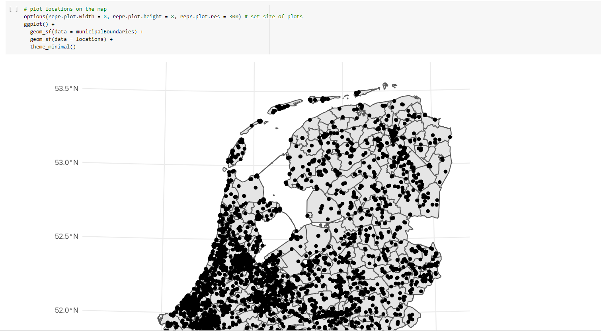
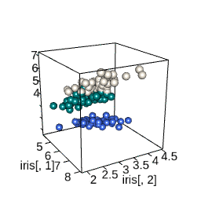

```{r setup, include=FALSE}
knitr::opts_chunk$set(echo = FALSE)
library(tidyverse)
library(rgl)
library(magick)
library(plotly)
knitr::knit_hooks$set(webgl = hook_webgl)
```

## <span>.</span>Outline

- Recap of the June meeting

- `graphics` library

- 3D warning

- `rgl` library

- `plotly` library

- `magick` library

- Code Surgery - Sales data analysis


## <span>.</span>June meeting  {.columns-1}

Spatial analysis

{width=65%}

## <span>.</span>3D warning  {.columns-1}

Three dimensional objects are very popular but negatively affect the accuracy and speed at which one can interpret a graphic in most cases. 

Good for:

- scatter and surface plots

Bad for:

- barplots or pie charts.


## <span>.</span>`graphics` library {.columns-2}

```{r, echo=TRUE, eval=FALSE}
# simple right circular cone
cone <- function(x, y){
sqrt(x ^ 2 + y ^ 2)
}
 
# prepare variables
x <- y <- seq(-1, 1, length = 30)
z <- outer(x, y, cone)
 
# plot the 3D surface
persp(x, y, z)
```

<p class="forceBreak"></p>

```{r, echo=FALSE, eval=TRUE}
cone <- function(x, y){
    sqrt(x ^ 2 + y ^ 2)
    }
x <- y <- seq(-1, 1, length = 30)
z <- outer(x, y, cone)
persp(x, y, z)
```

## <span>.</span>`rgl` library {.columns-2}

```{r, echo=TRUE, eval=FALSE}
library(rgl)
# This is to output a rgl plot in a rmarkdown document.
setupKnitr()
# Add a new column with color to iris
mycolors <- c('royalblue1', 'darkcyan', 'oldlace')
iris$color <- mycolors[ as.numeric(iris$Species) ]
# Plot
plot3d( 
  x = iris$`Sepal.Length`, y = iris$`Sepal.Width`, z = iris$`Petal.Length`, 
  col = iris$color, 
  type = 's', 
  radius = .1,
  xlab="Sepal Length", ylab="Sepal Width", zlab="Petal Length")
# To display in an R Markdown document:
rglwidget()
```

<p class="forceBreak"></p>

```{r, echo=FALSE, eval=TRUE}
library(rgl)
# This is to output a rgl plot in a rmarkdown document.
setupKnitr()
# Add a new column with color to iris
mycolors <- c('royalblue1', 'darkcyan', 'oldlace')
iris$color <- mycolors[ as.numeric(iris$Species) ]
# Plot
plot3d( 
  x = iris$`Sepal.Length`, y = iris$`Sepal.Width`, z = iris$`Petal.Length`, 
  col = iris$color, 
  type = 's', 
  radius = .1,
  xlab="Sepal Length", ylab="Sepal Width", zlab="Petal Length")
# To display in an R Markdown document:
rglwidget()
```

## <span>.</span>`plotly` library {.columns-2}

```{r, echo=TRUE, eval=FALSE}
library(plotly)
# Data: volcano is provided by plotly
# Plot
p <- plot_ly(z = volcano, type = "surface")
p 
```
<p class="forceBreak"></p>

```{r, echo=FALSE,eval =TRUE}
library(plotly)
p <- plot_ly(z = volcano, type = "surface")
p 
```

## <span>.</span>`rgl` + `magick` {.columns-2}

```{r, echo = T, eval = F}
library(rgl)
library(magick)
mycolors <- c('royalblue1', 'darkcyan', 'oldlace')
iris$color <- mycolors[ as.numeric(iris$Species) ]
# Static chart
plot3d( iris[,1], iris[,2], iris[,3], col = iris$color, type = "s", radius = .2 )
# We can indicate the axis and the rotation velocity
play3d( spin3d( axis = c(0, 0, 1), rpm = 20), duration = 10 )
# Save as a gif
movie3d(
  movie="3dAnimatedScatterplot", 
  spin3d( axis = c(0, 0, 1), rpm = 7),
  duration = 10, 
  dir = "/content/drive/MyDrive/Colab Notebooks/tb-data-science-talks/2022-07-28/presentation/",
  type = "gif", 
  clean = TRUE)
```
<p class="forceBreak"></p>




## <span>.</span>Example of the Simple Features {.columns-1}

```{r, echo = F, eval = T}
# sf collection from file
data = st_read("logo.shp", quiet = TRUE) 
data %>% 
  ggplot() + 
  geom_sf() 
```

## <span>.</span>Example of the Surface {.columns-1}

```{r}
setupKnitr()
load("surface.RData")
z <- surface
x <- as.numeric(rownames(surface))
y <- as.numeric(colnames(surface))
zlim <- range(z, na.rm = T)
zlen <- zlim[2] - zlim[1] + 1
colorlut <- terrain.colors(zlen) # height color lookup table
col <- colorlut[ z - zlim[1] + 1 ] # assign colors to heights for each point
surface3d(x, y, z, color = col, back = "lines")
rglwidget()
```


## <span>.</span>Code Surgery - Sales data analysis

{width=65%}

