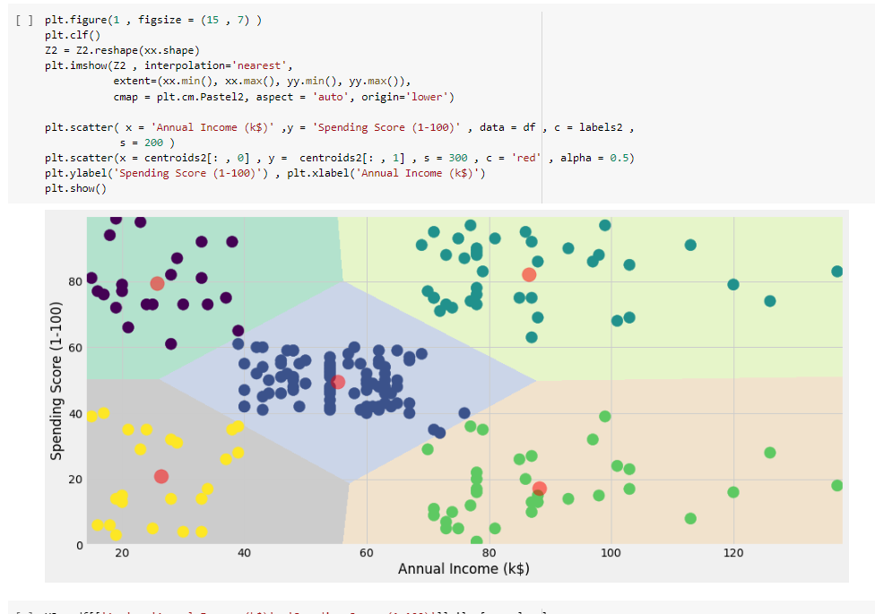

```{r setup, include=FALSE}
knitr::opts_chunk$set(echo = FALSE)
library(tidyverse)
iris %>% write_csv("iris.csv")
```

## <span>.</span>Outline

- Recap of the July meeting

- Cluster analysis 

- Clustering algorithms

- Python libraries

-- `sklearn` 

-- `scipy`

- Code Surgery - Customer Segmentation


## <span>.</span>July meeting  {.columns-2}

**3 and higher dimensional plots**

```{r, echo=TRUE, eval=FALSE}
# simple right circular cone
cone <- function(x, y){
sqrt(x ^ 2 + y ^ 2)
}
 
# prepare variables
x <- y <- seq(-1, 1, length = 30)
z <- outer(x, y, cone)
 
# plot the 3D surface
persp(x, y, z)
```

<p class="forceBreak"></p>

```{r, echo=FALSE, eval=TRUE}
cone <- function(x, y){
    sqrt(x ^ 2 + y ^ 2)
    }
x <- y <- seq(-1, 1, length = 30)
z <- outer(x, y, cone)
persp(x, y, z)
```

## <span>.</span>Cluster analysis  {.columns-1}

Cluster analysis or clustering is the task of grouping a set of objects in such a way that objects in the same group (called a cluster) are more similar (in some sense) to each other than to those in other groups (clusters).

## <span>.</span>Clustering algorithms  {.columns-1}

- K-means (tries to minimize the variance of data points within a cluster)

- Hierarchical clustering (seeks to build a hierarchy of clusters)

##  <span>.</span>Let's cluster something {.columns-1}

```{python, echo = TRUE, warning = FALSE, message = FALSE}
import pandas as pd # to manipulate tables
iris = pd.read_csv("iris.csv")
iris.head()
```

## <span>.</span>`iris` dataset {.columns-1}

```{python, echo = TRUE, warning = FALSE, message = FALSE}
iris.info()
```

## <span>.</span>`iris` dataset{.columns-1}

```{python, echo = TRUE, warning = FALSE, message = FALSE}
import seaborn as sns ; sns.set_style("whitegrid")
sns.pairplot(iris, hue = "Species", height = 2)
```

## <span>.</span>`iris` dataset{.columns-1}

```{python, echo = TRUE, warning = FALSE, message = FALSE}
sns.pairplot(iris, height = 2)
```

## <span>.</span>`KMeans` algorithm{.columns-1}

```{python, echo = TRUE, warning = FALSE, message = FALSE}
from sklearn.cluster import KMeans 
kmeans = KMeans(n_clusters = 3)
clust = kmeans.fit_predict(iris.loc[:, iris.columns != 'Species'])
clust = pd.DataFrame(clust, columns = ['Cluster'])
df = iris.join(clust)
df.head()
```

##  <span>.</span>Check the clusters{.columns-1}

```{python, echo = TRUE, warning = FALSE, message = FALSE}
pd.crosstab(df["Species"], df["Cluster"])
```

##  <span>.</span>Hierarchical clustering{.columns-1}

```{python, echo = TRUE, warning = FALSE, message = FALSE}
from scipy.cluster.hierarchy import dendrogram, linkage
import matplotlib.pyplot as plt
iris = iris.set_index('Species')
dist = linkage(iris, 'ward')
plt.figure(0)
dendrogram(dist, leaf_rotation=90, leaf_font_size=3, labels=iris.index)
plt.axhline(y=7, c='k')
plt.savefig("hier_clust.svg")
```
[hier_clust.svg](hier_clust.svg) 

## <span>.</span>`DBSCAN` algorithm{.columns-1}

```{python, echo = TRUE, warning = FALSE, message = FALSE}
from sklearn.cluster import DBSCAN 
iris = pd.read_csv("iris.csv")
db = DBSCAN() #eps=0.3, min_samples=10)
clust = db.fit(iris.loc[:, iris.columns != 'Species'])
clust = clust.labels_
clust = pd.DataFrame(clust, columns = ['Cluster'])
df = iris.join(clust)
df.head()
```

## <span>.</span>`DBSCAN` algorithm{.columns-1}

```{python, echo = TRUE, warning = FALSE, message = FALSE}
pd.crosstab(df["Species"], df["Cluster"])
```

## <span>.</span>Code Surgery - Customer Segmentation

{width=65%}

