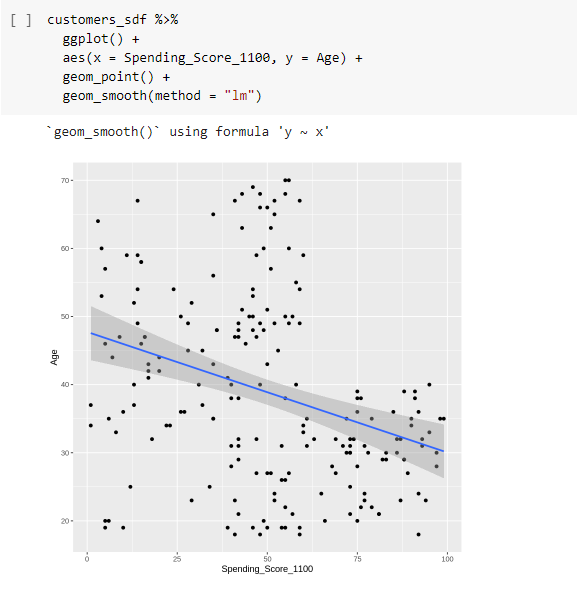
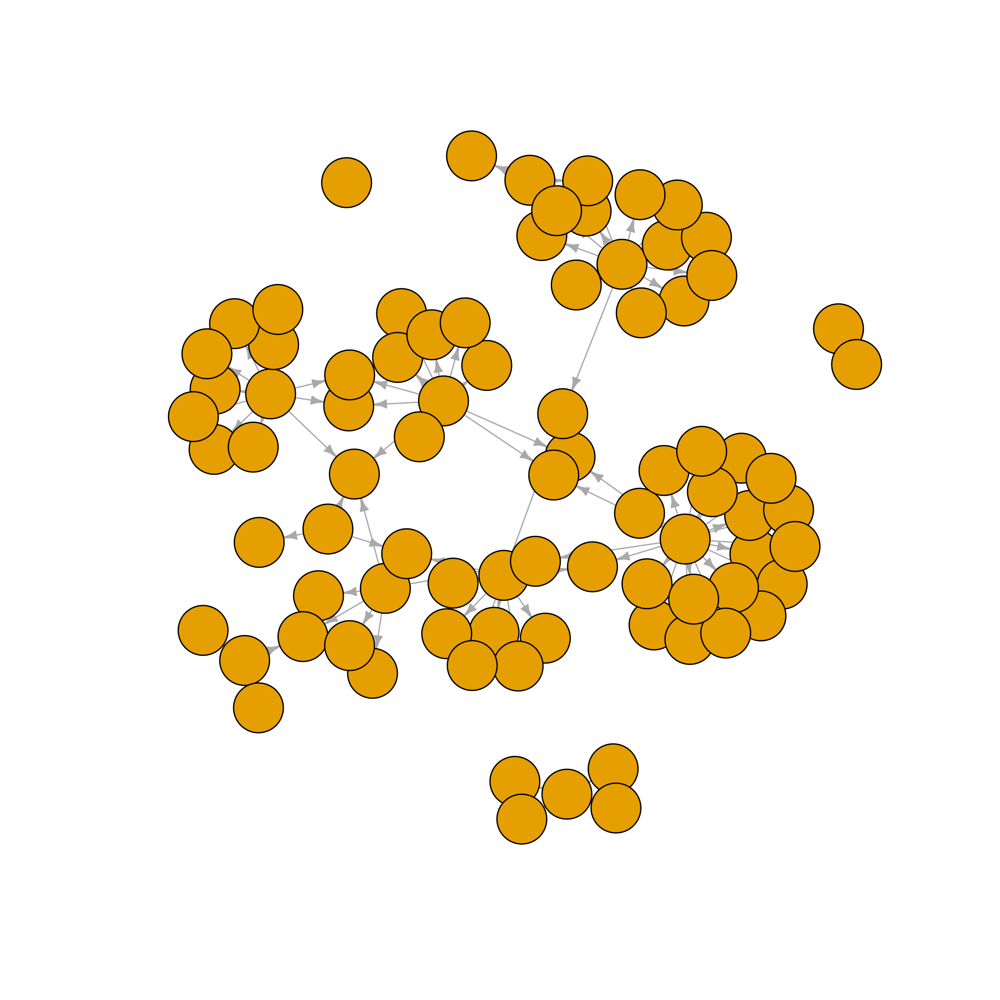

```{r setup, include=FALSE}
library(tidyverse)
```

## <span>.</span>Outline {.columns-1}

- Recap of the September meeting

- Data Science 💻

- Law **§**

- Code Surgery : EUR-Lex Network Analysis


## <span>.</span>September meeting  {.columns-1}

Data Science with Spark 

{width=65%}

## <span>.</span>Spark {.columns-2}

...

<p class="forceBreak"></p>

...

## <span>.</span>Code Surgery - EUR-Lex Network Analysis

{width=65%}

