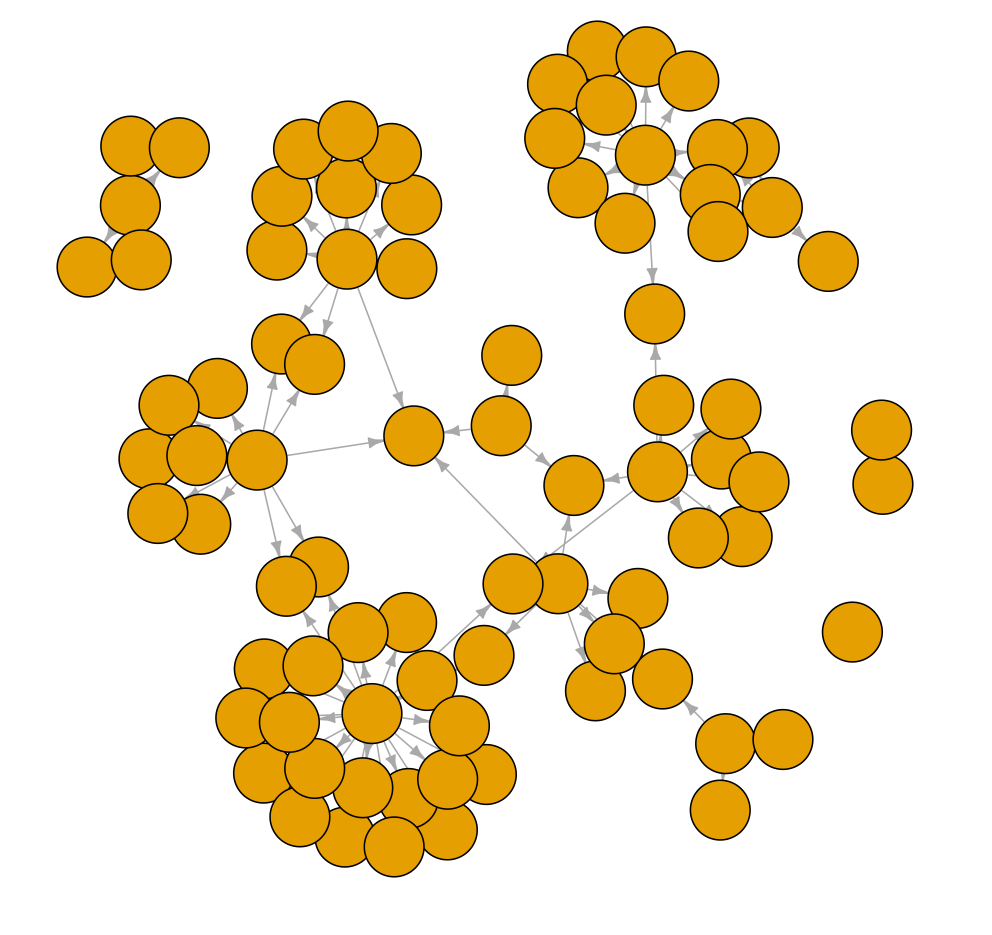

```{r setup, include=FALSE}
library(tidyverse)
library(DiagrammeR)
```

## <span>.</span>Outline

- Recap of the November meeting

- Deep Learning Tools and Hardware

- Code Surgery : Audio Classification (`Py` with `GPU`) 


## <span>.</span>November meeting {.columns-1}

```{r, echo = F, fig.align = 'center', out.width = "50%", fig.cap = "Vision Classification (`R` with `CPU`) "}
knitr::include_graphics('Capture-2022-11-24.PNG')
```


## <span>.</span>Deep Learning Tools {.columns-1}

```{r, echo=FALSE}
grViz("./ml.gv")
```


## <span>.</span>Code Surgery

```{r, echo = F, fig.align = 'center', out.width = "50%", fig.cap = "Audio Classification (`Py` with `GPU`) "}

```


